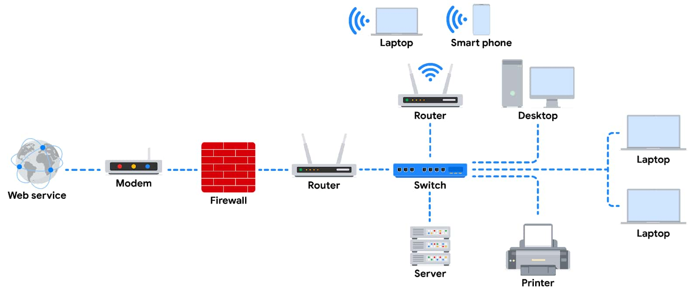
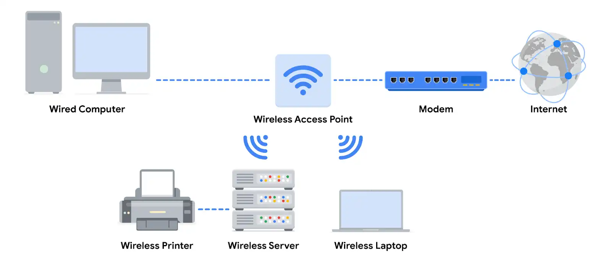
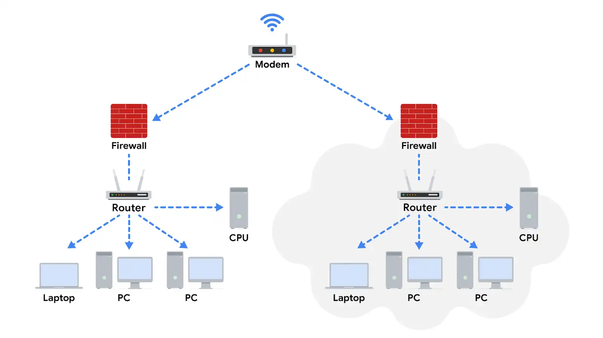

# Componentes, diagramas y dispositivos de red
#teoria #redes #ciberseguridad 

---
Una comprensión básica de la arquitectura de redes, a veces denominada diseño de redes, le ayudará a medida que conozca las vulnerabilidades de seguridad inherentes a todas las redes y cómo los actores maliciosos intentan explotarlas. ¡Empecemos!

## Dispositivos de red
Los dispositivos de red mantienen la información y los servicios para los usuarios de una red. Estos dispositivos se conectan a través de conexiones por cable e inalámbricas. Tras establecer una conexión con la red, los dispositivos envían paquetes de datos. Los paquetes de datos proporcionan información sobre el origen y el destino de los datos. Así es como se envía y recibe la información a través de los distintos dispositivos de una red.

La red es la infraestructura general que permite que los dispositivos se comuniquen entre sí. Los dispositivos de red son vehículos especializados como routers y Switch que gestionan lo que se envía y recibe a través de la red. Además, dispositivos como computadoras y teléfonos se conectan a la red a través de dispositivos de red.

### **Dispositivos y computadoras de escritorio**

La mayoría de los usuarios de Internet están familiarizados con los dispositivos cotidianos, como las computadoras personales, los ordenadores portátiles, los teléfonos móviles y las tabletas. Cada dispositivo y ordenador de sobremesa tiene una dirección MAC y una dirección IP ÚNICAS, que lo identifican en la red. También disponen de una interfaz de red que envía y recibe paquetes de datos. Estos dispositivos pueden conectarse a la red mediante un cable fijo o una conexión inalámbrica.
### **Cortafuegos**

Un **firewall** es un dispositivo de seguridad de red que supervisa el tráfico hacia o desde su red. Es como su primera línea de defensa. Los cortafuegos también pueden restringir el tráfico de red específico entrante y saliente. La organización configura las reglas de Seguridad del firewall. Los cortafuegos suelen residir entre la red interna segura y controlada y los recursos de red no fiables fuera de la organización, como Internet. Recuerde, sin embargo, que los firewalls son sólo una línea de defensa en el panorama de la ciberseguridad.
### **Servidores**

**Los servidores** proporcionan información y servicios para dispositivos como computadoras, dispositivos domésticos inteligentes y teléfonos inteligentes en la red. Los dispositivos que se conectan a un servidor se denominan clientes. El siguiente gráfico esboza este modelo, que se denomina modelo cliente-servidor. En este Modelo, los clientes envían peticiones al servidor para obtener Información y servicios. El servidor realiza las peticiones para los clientes. Algunos ejemplos comunes son los servidores DNS que realizan búsquedas de nombres de dominio para sitios de Internet, los servidores de archivos que almacenan y recuperan archivos de una base de datos y los servidores de correo corporativo que organizan el correo de una empresa.

### **Concentradores y conmutadores**

Tanto los concentradores como los conmutadores dirigen el tráfico en una red local. Un **concentrador** es un dispositivo que proporciona un punto común de conexión para todos los dispositivos conectados directamente a él. Además, los concentradores repiten toda la información hacia todos los puertos. Desde el punto de vista de la Seguridad, esto hace que los concentradores sean vulnerables a las escuchas. Por esta razón, los concentradores no se utilizan tan a menudo en las redes modernas; la mayoría de las organizaciones utilizan en su lugar conmutadores. Los concentradores se utilizan más comúnmente para una configuración de red limitada, como una oficina doméstica.

Los conmutadores son la opción preferida para la mayoría de las redes. Un **Switch** reenvía paquetes entre dispositivos conectados directamente a él. Analizan la dirección de destino de cada paquete de datos y lo envían al dispositivo previsto. Los conmutadores mantienen una tabla de direcciones MAC que coteja las direcciones MAC de los dispositivos de la red con los números de puerto del conmutador y reenvía los paquetes de datos entrantes según la dirección MAC de destino. Los conmutadores forman parte de la capa de vínculo de datos en el Modelo TCP/IP. En general, los conmutadores mejoran el rendimiento y la Seguridad.
### **Routers**

Los**routers** conectan redes y dirigen el tráfico, basándose en la dirección IP de la red de destino. Los routers permiten que los dispositivos de diferentes redes se comuniquen entre sí. En el Modelo TCP/IP, los routers forman parte de la capa de red. La dirección IP de la red de destino está contenida en la cabecera IP. El router lee la información de la cabecera IP y reenvía el Paquete al siguiente router en la ruta de acceso al destino. Esto continúa hasta que el paquete llega a la red de destino. Los routers también pueden incluir una característica de firewall que permite o bloquea el tráfico entrante basándose en la información de la transmisión. Esto impide que el tráfico malicioso entre en la red privada y dañe la red de área local.
### **Módems y puntos de acceso inalámbricos**

**Los módems** suelen conectar su casa u oficina con un proveedor de servicios de Internet (ISP). Los ISP proporcionan conexión a Internet a través de líneas telefónicas o cables coaxiales. Los módems reciben transmisiones o señales digitales de Internet y las traducen en señales analógicas que pueden viajar a través de la conexión física que le proporciona su ISP. Normalmente, los módems se conectan a un router que toma las transmisiones descodificadas y las envía a la red local.

**Nota:** las redes empresariales utilizadas por las grandes organizaciones para conectar a sus usuarios y dispositivos suelen utilizar otras tecnologías de banda ancha para gestionar el tráfico de gran volumen, en lugar de utilizar un módem.

**Punto de acceso inalámbrico**

Un **punto de acceso inalámbrico** envía y recibe señales digitales a través de ondas de radio creando una red inalámbrica. Los dispositivos con adaptadores inalámbricos se conectan al punto de acceso mediante Wi-Fi. **Wi-Fi** hace referencia a un conjunto de Estándares que utilizan los dispositivos de red para comunicarse de forma inalámbrica. Los puntos de acceso inalámbricos y los dispositivos conectados a ellos utilizan protocolos Wi-Fi para enviar datos a través de ondas de radio donde se envían a routers y Switch y se dirigen a lo largo de la ruta hasta su destino final.

## **Uso de diagramas de red como analista de seguridad**

Los diagramas de red permiten a los administradores de red y al personal de seguridad imaginar la arquitectura y el diseño de la red privada de su organización.

Los**diagramas de** red son mapas que muestran los dispositivos de la red y cómo se conectan. Los diagramas de red utilizan pequeños gráficos representativos para retratar cada dispositivo de la red y líneas de puntos para mostrar cómo se conecta cada dispositivo entre sí. Mediante el estudio de los diagramas de red, los analistas de seguridad desarrollan y perfeccionan sus estrategias para proteger las arquitecturas de red.

