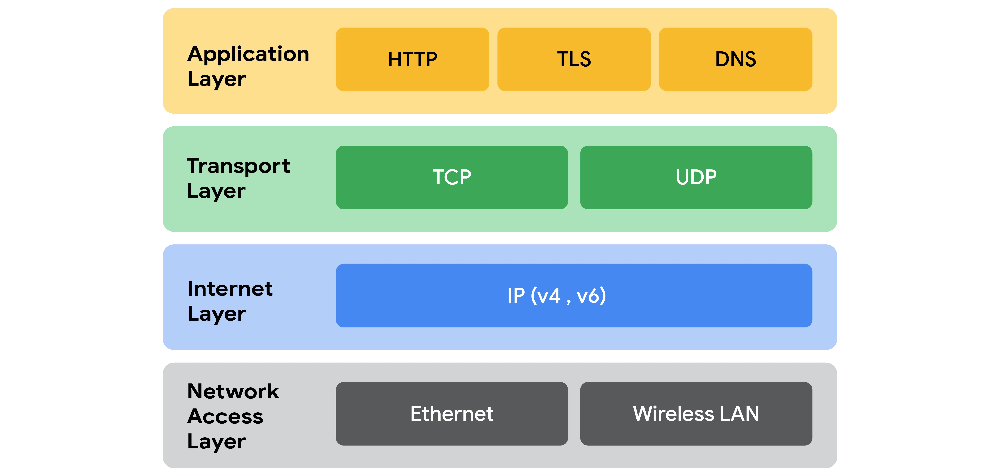

# Más información sobre el Modelo TCP/IP
#teoria #ciberseguridad #redes 

---
El **Modelo TCP/IP** es un framework utilizado para visualizar cómo se organizan y transmiten los datos a través de una red. Este Modelo ayuda a los ingenieros de redes y a los analistas de seguridad de redes a conceptualizar los procesos en la red y a comunicar dónde se producen las interrupciones o las amenazas a la seguridad.

El Modelo TCP/IP tiene cuatro capas: ==la capa de accesibilidad a la red, la capa de Internet, la capa de transporte y la capa de aplicación==. Cuando se solucionan problemas en la red, los profesionales de la Seguridad pueden analizar qué capas se vieron afectadas por un ataque en función de los procesos implicados en un incidente.

## Capa de acceso a la red

La capa de acceso a la red, a veces denominada capa de vínculo de datos, se ocupa de la **creación de paquetes de datos y su transmisión a través de una red**. Esta capa corresponde al hardware físico implicado en la transmisión de la red. Concentradores, módems, cables y cableado se consideran parte de esta capa. 

El protocolo de resolución de direcciones (ARP) forma parte de la capa de accesibilidad a la red. Dado que las direcciones MAC se utilizan para identificar hosts en la misma red física, ARP es necesario para asignar direcciones IP a direcciones MAC para la comunicación de red local.
## Capa de Internet

La capa de Internet, a veces denominada capa de red, es responsable de **garantizar la entrega al host de destino, que potencialmente reside en una red diferente**. Garantiza que las direcciones IP se adjunten a los paquetes de datos para indicar la ubicación del remitente y el destinatario. 

La capa de Internet también determina qué protocolo es responsable de entregar los paquetes de datos y garantiza la entrega al host de destino. Estos son algunos de los protocolos comunes que operan en la capa de Internet:

- **Protocolo de Internet (IP)**. IP envía los paquetes de datos al destino correcto y se basa en el Protocolo de control de transmisión/Protocolo de Datagramas de Usuario (TCP/UDP) para entregarlos al servicio correspondiente. Los paquetes IP permiten la comunicación entre dos redes. Se encaminan desde la red emisora hasta la red receptora. El TCP, en particular, retransmite cualquier dato que se pierda o esté corrupto.
    
- **Protocolo de mensajes de control de Internet (ICMP**). El ICMP comparte información sobre errores y actualizaciones del estado de los paquetes de datos. Esto resulta útil para detectar y solucionar errores de red. El ICMP transmite información sobre paquetes que se han perdido o que han desaparecido en tránsito, problemas con la conectividad de la red y paquetes redirigidos a otros routers.
## Capa de transporte

La capa de transporte es responsable de la **entrega de datos entre dos sistemas o redes e incluye protocolos para controlar el flujo de tráfico a través de una red**. TCP y UDP son los dos protocolos de transporte que se dan en esta capa.
### Protocolo de control de transmisión

El Protocolo de **control de transmisión (TCP** ) es un protocolo de comunicación de Internet que permite que dos dispositivos formen una conexión y transmitan datos. Garantiza que los Datos se transmitan de forma fiable al servicio de destino. TCP contiene el número de puerto del servicio de destino previsto, que reside en el encabezado TCP de un paquete TCP/IP.
### Protocolo de Datagramas de Usuario

El **Protocolo de Datagramas de Usuario (UDP)** es un protocolo no orientado a la conexión que no establece una conexión entre dispositivos antes de las transmisiones. Lo utilizan aplicaciones a las que no les preocupa la fiabilidad de la transmisión. Los Datos enviados a través de UDP no son objeto de un seguimiento tan exhaustivo como los enviados mediante TCP. Dado que UDP no establece conexiones de red, se utiliza sobre todo para aplicaciones sensibles al rendimiento que funcionan en tiempo real, como la transmisión de vídeo.
## Capa de aplicación

La capa de aplicación en el Modelo TCP/IP es similar a las capas de aplicación, presentación y sesión del Modelo OSI. La capa de aplicación es la responsable de realizar las solicitudes de red o de responder a las peticiones. Esta capa define a qué servicios y aplicaciones de Internet puede acceder cualquier usuario. Los protocolos de la capa de aplicación determinan cómo interactuarán los paquetes de datos con los dispositivos receptores. Algunos protocolos comunes utilizados en esta capa son:

- Protocolo de transferencia de hipertexto (HTTP)
- Protocolo simple de transmisión de correo (SMTP)
- Secure Shell (SSH)
- Protocolo de transferencia de archivos (FTP)
- Sistema de nombres de dominio (DNS)

Los protocolos de la capa de aplicación se basan en capas subyacentes para transferir los datos a través de la red.
## Modelo TCP/IP frente al modelo OSI

El **OSI** organiza visualmente los protocolos de redes en diferentes capas. Los profesionales de las redes suelen utilizar este modelo para comunicarse entre sí sobre posibles fuentes de problemas o amenazas a la seguridad cuando se producen.

El Modelo TCP/IP combina varias capas del modelo OSI. Existen muchas similitudes entre ambos Modelos. Ambos Modelos definen Estándares para las redes y dividen el proceso de comunicación de la red en diferentes capas. El Modelo TCP/IP es una versión simplificada del modelo OSI.
## Puntos clave

Tanto el modelo TCP/IP como el OSI son modelos conceptuales que ayudan a los profesionales de las redes a visualizar los procesos y protocolos de red en lo que respecta a la transmisión de datos entre dos o más sistemas. El Modelo TCP/IP contiene cuatro capas y el modelo OSI, siete.