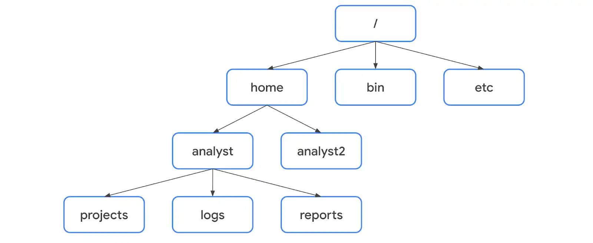

# Estándar de jerarquía del sistema de archivos (FHS)
#linux #Ciberseguridad #Teoría 

---
**Estándar de jerarquía del sistema de archivos** (FHS) es el componente de Linux que organiza los datos. El FHS es importante porque define cómo se organizan los directorios, el contenido de los directorios y otros tipos de almacenamiento en el sistema operativo.

Este diagrama ilustra la jerarquía de relaciones bajo el FHS:

Bajo el FHS, la ubicación de un archivo puede describirse mediante una ruta de archivo. Una **ruta de archivo** es la ubicación de un archivo o directorio. En la ruta de archivo, los distintos niveles de la jerarquía están separados por una barra oblicua (/).
### Directorio raíz

El **directorio raíz** es el ==directorio de más alto nivel en Linux==, y siempre se representa con una barra oblicua (/). Todos los subdirectorios se ramifican a partir del directorio raíz. Los subdirectorios pueden continuar ramificándose hasta tantos niveles como sea necesario.
### Directorios FHS estándar

Directamente debajo del directorio raíz, encontrará los directorios FHS estándar. En el diagrama, home, bin, y etc son directorios FHS estándar. He aquí algunos ejemplos de lo que contienen los directorios estándar:

- **/home:** Cada usuario del sistema tiene su propio directorio personal.

- /**bin:** Este directorio significa "binario" y contiene archivos binarios y otros ejecutables. Los ejecutables son archivos que contienen una serie de órdenes que una computadora debe seguir para ejecutar programas y realizar otras funciones.

- **/etc:** Directorio que almacena los archivos de configuración del sistema.

- **/tmp:** Este Directorio almacena muchos archivos temporales. El directorio /tmp es utilizado habitualmente por los atacantes porque cualquier persona del sistema puede modificar los datos de estos archivos.

- **/mnt:** Este Directorio significa "montar" y almacena soportes, como unidades USB y discos duros.

**Consejo profesional**: Puede utilizar el comando `man hier` para obtener más información sobre el FHS y sus directorios estándar.

### Subdirectorios específicos de usuario
Bajo `home` hay subdirectorios para usuarios específicos. En el diagrama, estos usuarios son **analyst** y **analyst2**. Cada usuario tiene sus propios subdirectorios personales, como `projects`, `logs` o `reports`.

>[!NOTE]
>Cuando la ruta de acceso conduce a un subdirectorio por debajo del directorio personal del usuario, el directorio personal del usuario puede representarse con la tilde (~). Por ejemplo, `/home/analyst/logs` también puede representarse como `~/logs`.

Puede navegar a subdirectorios específicos utilizando sus rutas de archivo absolutas o relativas. ==La **ruta de archivo absoluta** es la ruta de archivo completa, que parte de la raíz==. Por ejemplo, `/home/analyst/projects` es una ruta de archivo absoluta. ==La **ruta de archivo relativa** es la ruta de archivo que parte del directorio actual de un usuario==.

**Nota:** Las rutas de archivo relativas pueden utilizar un punto (.) para representar el directorio actual, o dos puntos (..) para representar el padre del directorio actual. Un ejemplo de ruta de archivo relativa podría ser `../projects`.