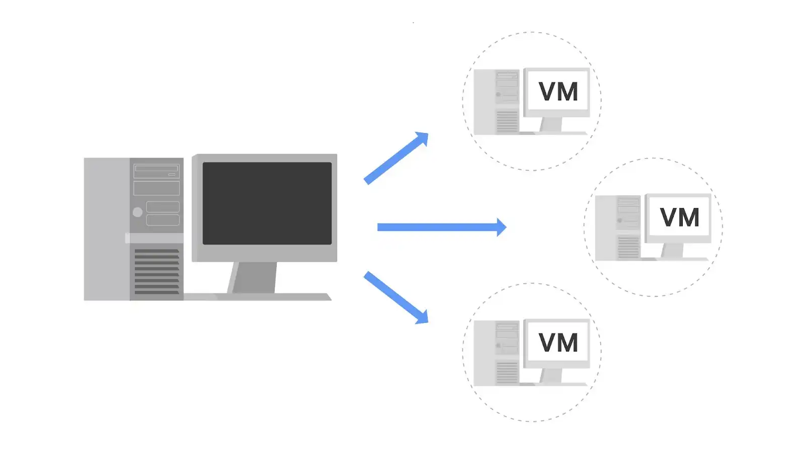

# Tecnología de virtualización
#Ciberseguridad #Teoría 

---
La virtualización es el proceso de utilizar software para crear representaciones virtuales de varias máquinas físicas. El término "virtual" se refiere a máquinas que no existen físicamente, pero que funcionan como si lo hicieran porque su software simula el hardware físico. Los sistemas virtuales no utilizan hardware físico dedicado. En su lugar, utilizan versiones definidas por software del hardware físico. Esto significa que una sola máquina virtual tiene una CPU virtual, almacenamiento virtual y otro hardware virtual. Los sistemas virtuales son sólo código.

Puede ejecutar varias máquinas virtuales utilizando el hardware físico de una sola computadora. Esto implica dividir los recursos de la computadora anfitriona para compartirlos entre todos los componentes físicos y virtuales. Por ejemplo, la **Memoria de acceso aleatorio (RAM)** es un componente de hardware utilizado para la memoria a corto plazo. Si una computadora tiene 16 GB de RAM, puede alojar tres máquinas virtuales de modo que la computadora física y las máquinas virtuales tengan cada una 4 GB de RAM. Además, cada una de estas máquinas virtuales tendría su propio sistema operativo y funcionaría de forma similar a una computadora típica.
## Beneficios de las máquinas virtuales

Los profesionales de la Seguridad utilizan habitualmente la virtualización y las máquinas virtuales. La virtualización puede aumentar la Seguridad de muchas tareas y también puede aumentar la eficacia.
### **Seguridad**

Uno de los beneficios es que la virtualización puede proporcionar un entorno aislado, o una caja de arena, en la máquina anfitriona física. Cuando una computadora tiene varias máquinas virtuales, estas máquinas virtuales son "invitados" de la computadora. En concreto, están aisladas de la computadora host y de otras máquinas virtuales invitadas. Esto proporciona una capa de Seguridad, ya que las máquinas virtuales pueden mantenerse separadas de los demás sistemas. Por ejemplo, si una máquina virtual individual se infecta con software malicioso, puede tratarse de forma más segura porque está aislada de las demás máquinas. Un profesional de la Seguridad también podría colocar intencionadamente software malicioso en una máquina virtual para examinarla en un entorno más seguro.

**Nota:** Aunque el uso de máquinas virtuales es útil cuando se investigan máquinas potencialmente infectadas o se ejecuta software malicioso en un entorno restringido, siguen existiendo algunos riesgos. Por ejemplo, un programa malicioso puede escapar a la virtualización y acceder a la máquina anfitriona. Esta es la razón por la que nunca debe confiar completamente en los sistemas virtualizados.
### **Eficiencia**

El uso de máquinas virtuales también puede ser una forma eficaz y cómoda de realizar tareas de Seguridad. Puede abrir varias máquinas virtuales a la vez y cambiar fácilmente de una a otra. Esto le permite agilizar las tareas de Seguridad, como probar y explorar varias aplicaciones.

Puede comparar la eficacia de una máquina virtual con la de un autobús urbano. Un solo autobús urbano tiene mucho espacio y es una forma eficaz de transportar a muchas personas simultáneamente. Si no existieran los autobuses urbanos, cada persona tendría que conducir su propio coche. Esto consume más gasolina, coches y otros Recursos que montar en el autobús urbano.

Del mismo modo que muchas personas pueden viajar en un autobús, muchas máquinas virtuales pueden alojarse en la misma máquina física. De esta forma, no se necesitan máquinas físicas separadas para realizar ciertas tareas.
## Otras formas de virtualización

Además de las máquinas virtuales, existen otras formas de virtualización. Algunas de estas tecnologías de virtualización no utilizan sistemas operativos. Por ejemplo, se pueden crear varios servidores virtuales a partir de un único servidor físico. También pueden crearse redes virtuales para utilizar de forma más eficiente el hardware de una red física.