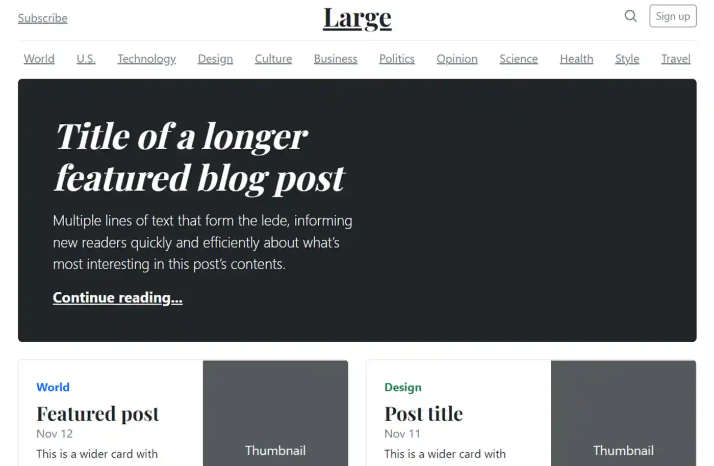
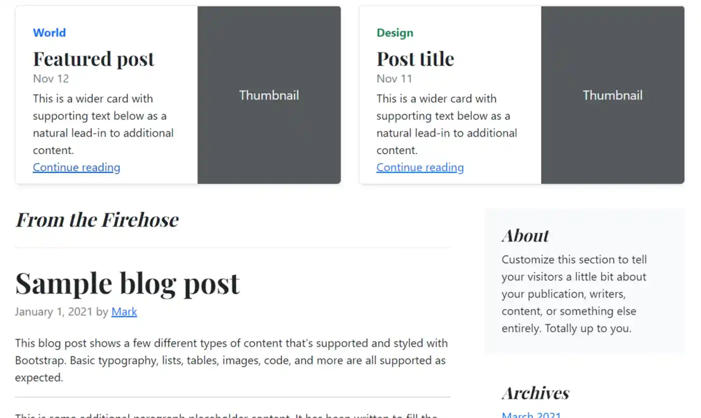
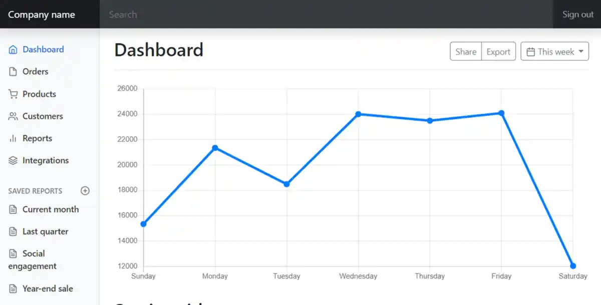

# Diseño
#teoria #html

---
A medida que construya páginas web a lo largo de su carrera, observará que muchas de ellas siguen diseños y estructuras similares. ==Este es el resultado de muchos años de investigación== sobre el diseño de la interfaz de usuario y la experiencia del usuario.

##  Diseño de la barra de  navegación superior
Los sitios web suelen tener un diseño de **barra de navegación** para proporcionar al usuario un conjunto de enlaces de anclaje esenciales. Éstos suelen enlazar con las áreas principales del sitio web, como las páginas de productos, las páginas de carreras profesionales o las páginas de contacto. Esto proporciona al visitante del sitio web una experiencia de navegación coherente.

## Disposición en carrusel
Los sitios web centrados en productos suelen utilizar un gran carrusel en su página de inicio para destacar sus productos, descuentos y ofertas. El carrusel contiene elementos de contenido que rotarán por la zona del carrusel a un intervalo fijo.

## Diseño de blog
El diseño de blog se utiliza para presentar varios elementos de contenido de distinta importancia. Se ve a menudo en sitios web de noticias en los que aparecerán nuevos artículos en la página cada día en función de los acontecimientos actuales.

El diseño suele presentar área de artículos de diferente tamaño seguidas de una serie de áreas de resumen de artículos que enlazan con los artículos completos.

## Diseño de panel de control
Los diseños de cuadros de mando se utilizan a menudo en el software empresarial para gestionar diversas aplicaciones web. Suelen presentar una barra lateral para la navegación con el área de contenido principal que contiene formularios para la configuración o la elaboración de informes de datos, como gráficos y tablas. Este diseño de moda proporciona una buena experiencia de usuario a los usuarios empresariales.
