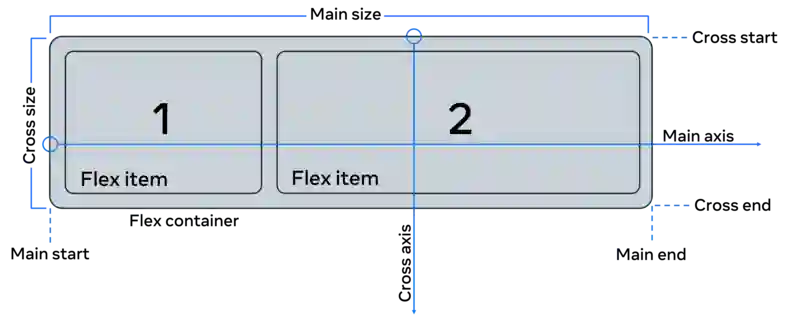

# Comprender Flexbox
#front-end #curso-4 #modulo-2

---
Flexbox es un tipo de contenedor. Flexbox puede superar las limitaciones causadas por contenedores como `block` e `inline` porque puede ==crecer, encogerse y alinear los elementos en su interior==, lo que proporciona un mejor control al programador sobre el contenido y el estilo de los elementos dentro del contenedor.

Flexbox es **unidimensional**, lo que significa que puede alinearlo tanto a lo largo de una fila como de una columna y que por defecto está configurado con la alineación por filas. 

Hay dos ejes, el **principal y el transversal**, muy parecidos a los ejes x e y utilizados en la geometría de coordenadas. ==Cuando se alinea a lo largo de la fila, el eje horizontal se denomina eje principal y el eje vertical eje transversal==. Para los elementos presentes dentro del contenedor flexbox, la colocación comienza desde la esquina superior izquierda moviéndose a lo largo del eje principal u horizontal. Cuando se llena la fila, los elementos continúan con la fila siguiente. 

Tenga en cuenta que con la ayuda de una propiedad llamada `flex-direction`, puede en su lugar voltear el eje principal para que discurra verticalmente y el eje transversal será entonces horizontal. 

Examinemos ahora algunas de las propiedades importantes que le permitirán configurar un flexbox.

## Propiedades de Flexbox
Código HTML original:
```html
<div>
	<div class="box box1"> One..</div>
	<div class="box box2"> Two..</div>
	<div class="box box3"> Three..</div>
	<div class="box box4"> Four..</div>
	<div class="box box5"> Five..</div>
	<div class="box box6"> Six..</div>
	<div class="box box7"> Seven..</div>
</div>
```
Código CSS original:
```css
.box{
	background-color: aquamarine;
	border-radius: 5px;
	margin: 2px;
	padding: 10px;
}
```
<div>
    <div class="box box1">One..</div>
    <div class="box box2">Two..</div>
    <div class="box box3">Three..</div>
    <div class="box box4">Four..</div>
    <div class="box box5">Five..</div>
    <div class="box box6">Six..</div>
    <div class="box box7">Seven..</div>
</div>
Hay siete contenedores div dentro del archivo HTML.

El archivo CSS correspondiente contiene reglas para las siete etiquetas div que tienen la clase box. Observe cómo se dan dos nombres de clase para cada una de las etiquetas, uno común a todas las clases y otro independiente. El estilo se aplica a todos los contenedores.

Ahora vamos a añadir propiedades al contenedor flex convirtiéndolo en flex.
### `display: flex;`
```css
.flex{
	display: flex;
}
```
El resultado son ahora siete contenedores flex que van de izquierda a derecha comenzando en la esquina superior izquierda.

<div class="flex">
    <div class="box box1">One..</div>
    <div class="box box2">Two..</div>
    <div class="box box3">Three..</div>
    <div class="box box4">Four..</div>
    <div class="box box5">Five..</div>
    <div class="box box6">Six..</div>
    <div class="box box7">Seven..</div>
</div>

### Propiedades de alineación
Examinemos algunas propiedades de alineación dentro del flex. Hay cuatro propiedades principales que se utilizan para alinear un contenedor flex y los elementos presentes en su interior:

- `justify-content`. Para alinear los elementos en el eje principal.
- `align-items`. Para la alineación de elementos en el eje transversal.
- `align-self`. Para alinear elementos en el eje transversal.
- `align-content`. Se utiliza para empaquetar líneas flex y controlar el espacio.    

De todos ellos, `justify-content` y a`lign-items` se utilizan con frecuencia para los dos ejes respectivos.
#### `justify-content;`
css:
```css
.jc {
	justify-content: center
}
```

<div class="flex jc">
    <div class="box box1">One..</div>
    <div class="box box2">Two..</div>
    <div class="box box3">Three..</div>
    <div class="box box4">Four..</div>
    <div class="box box5">Five..</div>
    <div class="box box6">Six..</div>
    <div class="box box7">Seven..</div>
</div>

#### `flex-wrap;`
El valor predeterminado para esta propiedad es `nowrap`, lo que significa que los elementos abarcarán todo el ancho del eje.
```css
.wrap {
	flex-wrap: wrap;
}
```
<div class="flex jc wrap w-200">
    <div class="box box1">One..</div>
    <div class="box box2">Two..</div>
    <div class="box box3">Three..</div>
    <div class="box box4">Four..</div>
    <div class="box box5">Five..</div>
    <div class="box box6">Six..</div>
    <div class="box box7">Seven..</div>
</div>

#### `flex-direction;`
Esta propiedad se utiliza para establecer el eje principal, que es una `row` por defecto. Básicamente significa que está cambiando su eje principal de filas horizontales a columnas verticales.
```css
.flex-col {
	flex-direction: column;
}
```
<div class="flex jc flex-col">
    <div class="box box1">One..</div>
    <div class="box box2">Two..</div>
    <div class="box box3">Three..</div>
    <div class="box box4">Four..</div>
    <div class="box box5">Five..</div>
    <div class="box box6">Six..</div>
    <div class="box box7">Seven..</div>
</div>

#### `align-items;`
La alineación en el eje transversal se realiza con la ayuda de esta propiedad. Cambiemos su valor a `flex-end`.
```css
.align-items {
	align-items: flex-end;
}
```
<div class="flex jc flex-col align-items">
    <div class="box box1">One..</div>
    <div class="box box2">Two..</div>
    <div class="box box3">Three..</div>
    <div class="box box4">Four..</div>
    <div class="box box5">Five..</div>
    <div class="box box6">Six..</div>
    <div class="box box7">Seven..</div>
</div>
El término `end` se refiere al lado derecho de la página, ya que el lado izquierdo se considera el principio.
#### `align-self;`
Esta propiedad puede utilizarse en elementos individuales dentro del flex.
```css
.align-self {
	align-self: center;
}
```
<div class="flex jc flex-col align-items">
    <div class="box box1">One..</div>
    <div class="box box2">Two..</div>
    <div class="box box3 align-self">Three..</div>
    <div class="box box4">Four..</div>
    <div class="box box5">Five..</div>
    <div class="box box6">Six..</div>
    <div class="box box7">Seven..</div>
</div>
#### `gap`
La propiedad `gap` puede utilizarse para crear espacio entre los elementos a lo largo del eje principal. También puede configurar individualmente los huecos en filas y columnas utilizando las propiedades `row-gap` y `column-gap`.
```css
.gap {
  gap: 10px;
}
```
<div class="flex jc flex-col align-items gap">
    <div class="box box1">One..</div>
    <div class="box box2">Two..</div>
    <div class="box box3 align-self">Three..</div>
    <div class="box box4">Four..</div>
    <div class="box box5">Five..</div>
    <div class="box box6">Six..</div>
    <div class="box box7">Seven..</div>
</div> 
#### `flex-grow` / `flex-shrink` / `flex-basis`
 Los valores corresponden a las tres propiedades, a saber, `flex-grow` fijado en `0`, `flex-shrink` en `1` y `flex-basis` en `auto`. La flex-basis fija el tamaño inicial del contenedor. y juntas definen la rigidez o flexibilidad y dinamismo que se quiere añadir al flexbox.
```css
.flex-g-s-b {
	flex: 1 1 auto;
}
```
<div class="flex wrap jc w-400 gap flex-g-s-b">
    <div class="box box1">One..</div>
    <div class="box box2">Two..</div>
    <div class="box box3">Three..</div>
    <div class="box box4">Four..</div>
    <div class="box box5">Five..</div>
    <div class="box box6">Six..</div>
    <div class="box box7">Seven..</div>
</div> 


La tercera caja ocupa ahora todo el espacio libre disponible porque el valor de `flex-grow` se ha fijado en `1`. Así que si tenemos `flex-grow` fijado en `1`, todos los hijos tendrán el mismo tamaño. Y si uno de los hijos tiene un valor de `1,5`, ese hijo ocupará más espacio que los demás.